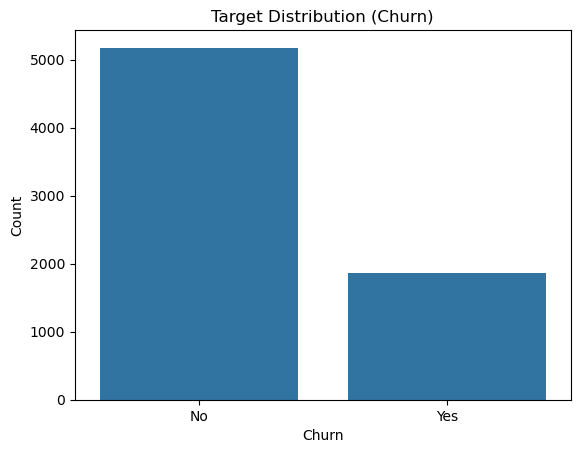
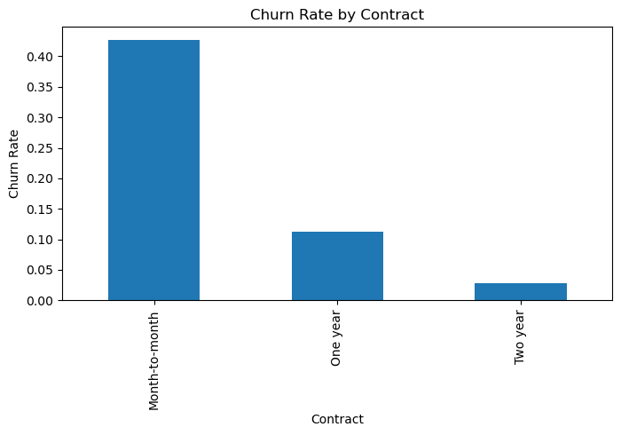
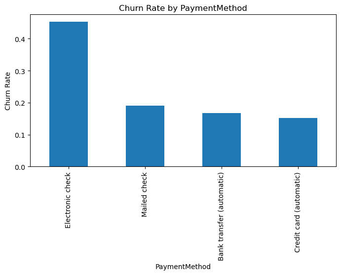
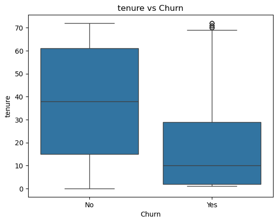
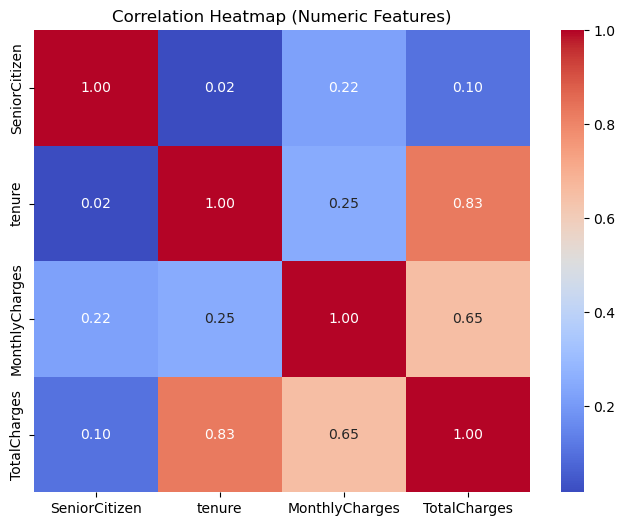
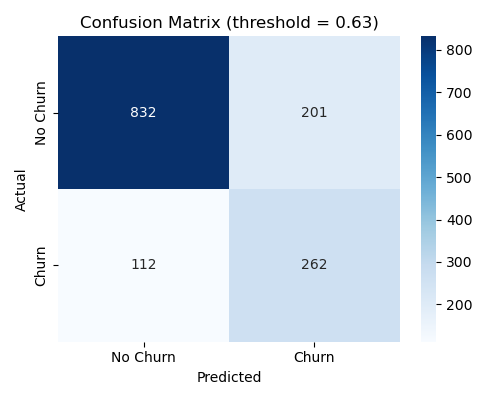
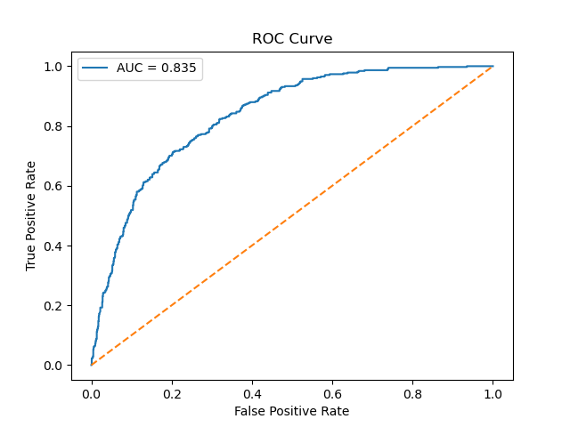
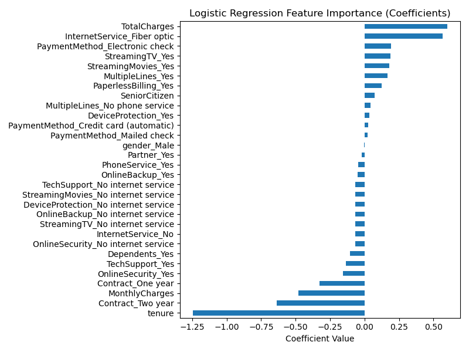

# 📊 Customer Churn Prediction with Logistic Regression  


**End-to-End Machine Learning Project**

---

## 🔍 Project Overview

Customer churn is one of the most critical business problems for subscription-based companies such as **telecommunication providers**.  
The goal of this project is to **predict whether a customer will churn (leave the company)** using historical customer data and a **Logistic Regression** model.

This project is designed as a **production-style ML pipeline**, not a notebook experiment.  
It includes:

- Comprehensive **Exploratory Data Analysis (EDA)**  
- Clean and reusable **preprocessing pipeline**  
- Multiple **model improvement iterations**  
- **Class imbalance handling & threshold tuning**  
- Clear **business-oriented evaluation**  
- **Visual artifacts** suitable for reporting and LinkedIn sharing  

---

## 🎯 Business Problem

> *“Which customers are likely to churn, so that we can take proactive actions?”*

### Why churn prediction matters:
- Acquiring new customers is **much more expensive** than retaining existing ones
- Early churn detection allows:
  - Targeted retention campaigns
  - Personalized offers
  - Reduced revenue loss

### Problem Type:
- **Binary Classification**
  - `Churn = Yes → 1`
  - `Churn = No → 0`

---

## 📁 Dataset

**Telco Customer Churn Dataset**  
- Rows: **7,043**
- Columns: **21**
- Target variable: `Churn`

### Feature Types:
- **Demographic**: gender, SeniorCitizen, Partner, Dependents  
- **Service-related**: InternetService, TechSupport, OnlineSecurity, StreamingTV, etc.  
- **Contract & billing**: Contract, PaymentMethod, MonthlyCharges, TotalCharges  
- **Tenure information**

📌 Note:  
`TotalCharges` is provided as a string in the raw dataset and required explicit conversion during preprocessing.

---

## 🗂️ Project Structure

A concise, readable overview of the project layout:

- 📁 **customer_churn_project/**
  - 📁 **data/**
    - `WA_Fn-UseC_-Telco-Customer-Churn.csv` — source dataset
  - 📁 **reports/**
    - `eda_summary.md` — written EDA findings
    - 📁 **figures/** — generated visual assets
      - `target_distribution.png` — target class counts
      - `churn_by_contract.png` — churn rate by contract type
      - `churn_by_paymentmethod.png` — churn by payment method
      - `churn_vs_tenure.png` — tenure distribution by churn
      - `correlation_heatmap.png` — feature correlations
      - `roc_curve.png` — ROC curve from evaluation
      - `confusion_matrix_threshold_0.63.png` — confusion matrix (best threshold)
      - `logistic_feature_importance.png` — model coefficient importance
  - 📁 **src/**
    - `config.py`, `data_loader.py`, `preprocessing.py` — core pipeline
    - `train.py`, `evaluate.py`, `main.py` — modelling & orchestration
    - 📁 **eda/** — EDA helpers & plotting
      - `eda_utils.py`, `eda_plots.py`, `run_eda.py`
  - `requirements.txt` — dependencies
  - `README.md` — project README

---

## ⚙️ Installation & Setup

```bash
pip install -r requirements.txt
```

**Required Libraries**
- pandas
- numpy
- scikit-learn
- matplotlib
- seaborn

▶️ How to Run the Project
1️⃣ Run Exploratory Data Analysis
Generates all EDA plots and a written summary report.

```bash
python -m src.eda.run_eda
```

Outputs:
- `reports/figures/` → EDA visualizations
- `reports/eda_summary.md` → Key findings

2️⃣ Train & Evaluate the Model
Runs preprocessing, training, threshold tuning, evaluation, and model visualizations.

```bash
python -m src.main
```

Outputs:
- Confusion matrix (best threshold)
- ROC curve
- Feature importance plot
- Console evaluation metrics

---

## 📊 Exploratory Data Analysis (EDA)

EDA was conducted as a decision-driven analysis, not random plotting.

**Key EDA Findings:**
- Target imbalance: ~26% churn → accuracy alone is misleading
- Tenure: Customers with shorter tenure churn significantly more
- Contract type: Month-to-month contracts show the highest churn rates
- MonthlyCharges: Higher monthly charges correlate with increased churn
- Support services: Customers with TechSupport or OnlineSecurity churn less
- Multicollinearity: TotalCharges ≈ tenure × MonthlyCharges

📌 These insights directly influenced preprocessing and metric selection.

**Key EDA Visuals:**

<table>
  <tr>
    <td align="center">
      <br/>
      <em>Target distribution — No vs Yes</em>
    </td>
    <td align="center">
      <br/>
      <em>Churn rate by Contract</em>
    </td>
    <td align="center">
      <br/>
      <em>Churn rate by Payment Method</em>
    </td>
  </tr>
  <tr>
    <td colspan="2" align="center">
      <br/>
      <em>Tenure comparison by churn</em>
    </td>
    <td align="center">
      <br/>
      <em>Correlation heatmap (feature relationships)</em>
    </td>
  </tr>
</table>

---

## 🧹 Preprocessing Pipeline

**Steps:**
- Drop `customerID` (no predictive value, potential leakage)
- Convert `TotalCharges` to numeric
- Handle missing values
- Encode target variable (`Yes`/`No` → `1`/`0`)
- One-hot encode categorical features
- Train/Test split with stratification

---

## 🤖 Model Development

**Baseline Model:**
- Logistic Regression

**Iterative Improvements:**
- Feature scaling (`StandardScaler`)
- Class imbalance handling (`class_weight="balanced"`)
- Hyperparameter tuning (`GridSearchCV`)
- Threshold tuning (optimized for F1-score)
- L1 regularization (feature selection attempt)

📌 Logistic Regression was pushed to its practical limits to understand its strengths and limitations.

---

## 📈 Model Evaluation

**Final Selected Configuration:**
- Logistic Regression (scaled)
- Class-weight balanced
- Tuned decision threshold ≈ 0.63

**Confusion Matrix (Best Threshold)**
| | Predicted No | Predicted Yes |
|---|---:|---:|
| Actual No | 832 | 201 |
| Actual Yes | 112 | 262 |

**Key Metrics (Churn = 1):**
- Precision: ~0.57
- Recall: ~0.70
- F1-score: ~0.63
- ROC-AUC: ~0.835

📌 Business interpretation:
- Model successfully identifies ~70% of churners
- False positives are reduced via threshold tuning
- Balanced trade-off between recall and operational cost

---

## 📉 Model Visualizations (For Reporting & LinkedIn)

Generated automatically:
- ✅ Confusion Matrix Heatmap
- ✅ ROC Curve
- ✅ Logistic Regression Feature Importance

**Model Visuals:**

<table>
  <tr>
    <td align="center">
      <br/>
      <em>Confusion matrix (threshold ≈ 0.63)</em>
    </td>
    <td align="center">
      <br/>
      <em>ROC Curve (AUC ≈ 0.835)</em>
    </td>
  </tr>
  <tr>
    <td colspan="2" align="center">
      <br/>
      <em>Logistic regression feature importance (coefficients)</em>
    </td>
  </tr>
</table>

These visuals make the model:
- Interpretable
- Presentable
- Business-friendly

---

## 🧠 Key Learnings

- Logistic Regression is a strong baseline, but has a performance ceiling
- Threshold tuning is crucial in churn problems
- ROC-AUC can be strong even when F1 is moderate
- Business context determines the “best” model behavior
- Script-based ML pipelines are closer to real-world production systems

---

## 🚀 Next Steps

Possible extensions:
- Tree-based models (XGBoost / LightGBM)
- Cost-sensitive evaluation
- Customer lifetime value (CLV) integration
- Deployment-ready API
- Monitoring & retraining strategy

---

## 🧾 Final Notes

This project intentionally avoids notebooks to demonstrate:
- Clean architecture
- Reproducibility
- Modularity

---

## 👤 Author

Hasan Adnan - AWS Solutions Architect & Software Engineer 

Feel free to connect and discuss improvements 🚀
